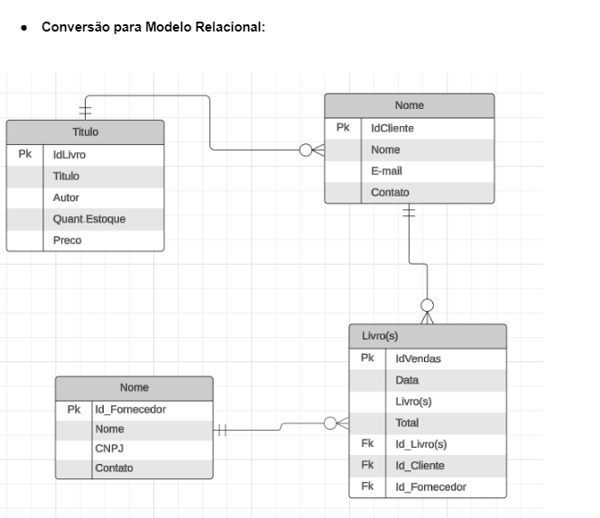

# Projeto de BookStore

A livraria BoolStore precisa de um sistema que armazene informações sobre
seus livros, clientes, vendas e fornecedores. O sistema permitirá que a livraria
gerencie seu estoque, registre as vendas realizadas, e mantenha um controle
sobre seus clientes e fornecedores.

### Requisitos do Sistema:
* Cadastro de livros com título, autor, preço, e quantidade em estoque.
* Registro de clientes com nome, email, e telefone.
* Registro de fornecedores com nome, CNPJ, e contato.
* Cadastro de vendas com data, cliente, livro(s) vendido(s), e total da venda.
* Relatório simples que liste as vendas realizadas por cliente.

### User Stories
* Como Cliente eu quero cadastrar meu nome, e-mail e meu contato para acessar a minha conta.
* Como Cliente eu quero visualizar os livros disponíveis para poder escolher qual eu quero.
* Como Fornecedor eu quero cadastrar meu nome, CNPJ e meu contato para poder acessar a minha conta.
* Como Fornecedor eu quero ver os livros disponíveis, e verificar o estoque para poder ter o controle.
* Como Fornecedor eu quero cadastrar os livros  e realizar o pedido do cliente  

## As Modelagem

#### Modelagem Conceitual e Lógica do Banco de Dados

#### Diagrama Entidade-Relacionamento (ER):

#### Conversão para Modelo Relacional

